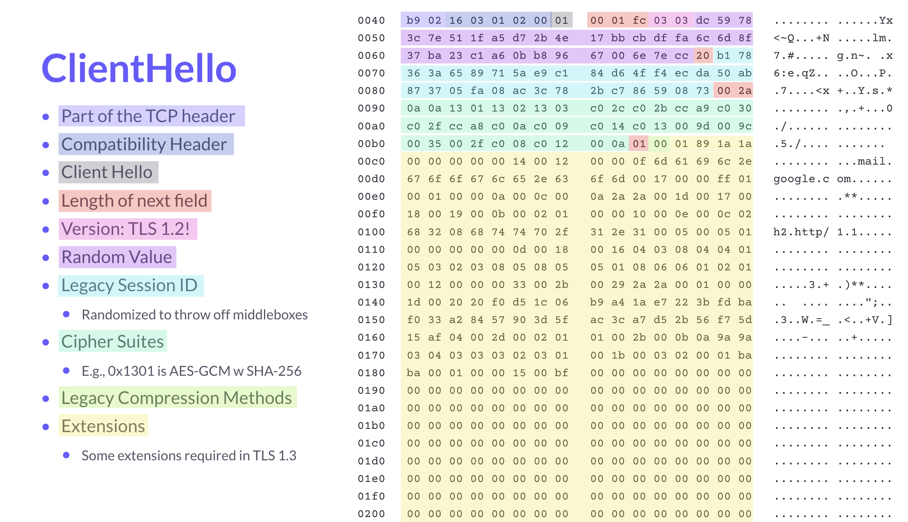
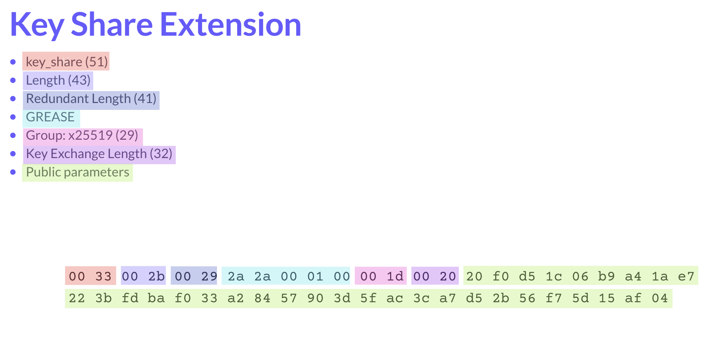

# Desription

Standardized [a few years ago][1], TLS 1.3 marks a drastic reform of prior TLS
versions. The principle themes of 1.3 are simplification, RTT reduction, and
rescricting ciphersuite support in accordance with contemporary cryptographic
best practices. TLS 1.3 simultaneously simplifies the protocol and improves
performance by reducing round trips at the TLS layer from 3 to 2 during the
handshake. This is accomplished by the client sending a "guess" of supported
ciphersuites in the ClientHello, along with KeyShare iformation. If the the
client has guessed correctly, the server can utilize the client's KeyShare and
immediately send its own KeyShare and certificate in its ServerHello. At this
point, we've only burned one round trip, and the client is ready to send its
Finished message along with its first segment of application data over the
symmetrically encrypted TLS channel!

In this project, we will implement the client side of a restricted TLS 1.3
handshake and a (basic) symmetric session. Students will incrementally build a
client along "checkpoints" in the autograder at each step of the TLS handshake,
ending with a TLS client capable of interacting with real-world endpoints. To
simplify the assignment's implementation, we will restrict the supported
ciphersuite to `TLS_AES_128_GCM_SHA256` using ECDHE with x25519 for key
exchange and 128-bit AES in GCM mode for symmetric encryption. We will not
implement session resumption/stores, pre-shared keys, downgrade prevention, or
other real-world concerns that would be required for a practical TLS
implementation.  Additionally, the server's certificate won't use any
intermediate CA's that the client will have to walk and validate.

The client will, however, need to validate the server certificate, checking for
things like expiration, signature validity, etc. The client will also implement
some TLS extensions such as Supported Versions (required in TLS 1.3), Key Share
(also rquired), and Server Name Indication ("SNI"). SNI is used to specify
which domain a client is attempting to connect to on a server that hosts
multiple domains (such as a load balancer in a cloud environment). SNI is very
simple to implement, as it only requires adding an additional field to the
Client Hello message.

Finally, to complete the "secure channel", the client will implement its side
of the Client Authentication extension (also known as "mutual TLS" or "mTLS").
Many web applications today use application-layer authentication (e.g. through
JSON Web Tokens or other signature-based schemes), but this can also be done
directly within the TLS protocol. The mTLS extension allows servers to
authenticate client identities at the TLS layer. In mTLS, the client presents
its certificate after completion of the handshake, allowing the server to
decide whether the client's certificate authentic and valid and drop the
connection if it isn't.

# Resources

- [TLS 1.3 RFC][1]
- [The Illustrated TLS 1.3 Connection][2]
- [A Detailed Look at RFC 8446 (a.k.a. TLS 1.3)][3]

Diagrams illustrating the format of ClientHello message, Supported Versions
Extension, and Key Share Extension:

# Specification

Coming soon!

[1]: https://www.rfc-editor.org/rfc/rfc8446
[2]: https://tls13.xargs.org/
[3]: https://blog.cloudflare.com/rfc-8446-aka-tls-1-3/
